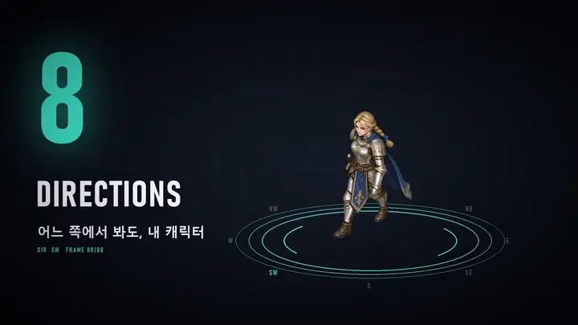
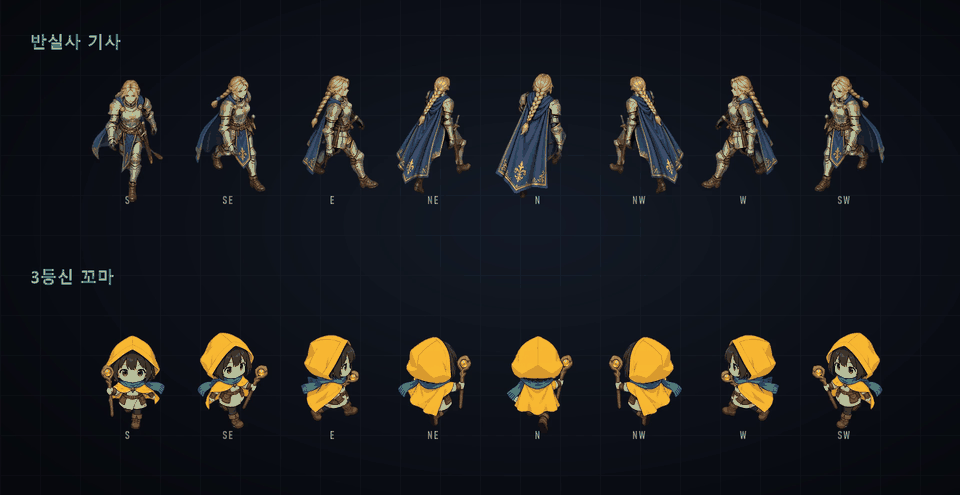

# 38Sprite

**한국어** · [English](README.en.md)

캐릭터 **삼면도(앞·옆·뒤) 한 장**과 **동작 설명**을 넣으면, 게임에 바로 쓸 수 있는 **8방향 스프라이트 시트**(PNG + JSON + GIF)를 만들어 주는 로컬 웹앱입니다.

이름의 38은 **3면도 → 8방향**이라는 뜻입니다.



https://github.com/user-attachments/assets/b035b982-9f20-44be-a81b-7010f28e75b1

영상 속 캐릭터 동작은 모두 38Sprite로 만든 결과물입니다.

실제 결과물 예시(8방향 걷기 시트):



## 할 수 있는 것

| 기능 | 설명 |
|---|---|
| 8방향 그림 자동 생성 | 삼면도를 올리면 Codex가 3×3 칸에 8방향 그림을 그립니다. 직접 그린 그림을 올려도 됩니다. |
| 방향 그림 검사 · 한 방향 다시 그리기 | 뒤 대각선(NE·NW)이 앞모습으로 그려지는 등 앞뒤가 바뀐 칸을 자동으로 찾아 알려 주고, 그 방향만 Codex로 다시 그립니다. |
| 동작 입력 3가지 | 글("제자리에서 걷기"), 레퍼런스 영상(춤 영상 등), 3D 마네킹(Codex가 동작 키프레임을 짜고, 방향마다 마네킹 영상을 만들어 그대로 따라 하게 함) |
| 영상 → 3D 마네킹 | 레퍼런스 영상에서 프레임마다 3D 뼈대를 뽑아(MediaPipe) 3D 마네킹을 그대로 움직이고, 방향마다 그 각도에서 따라 하게 해서 옆모습·뒷모습도 같은 동작이 됩니다. 뼈대 도구가 없으면 Codex가 영상을 보고 옮깁니다. |
| 기본 모션 세트 | 대기·걷기·달리기·공격·피격·쓰러짐을 버튼 하나로 한꺼번에 만듭니다. |
| 반복 · 한 번 동작 | 걷기·춤은 끊김 없는 구간을 찾아 루프로, 공격은 동작 구간만 잘라 냅니다. 쓰러짐처럼 처음 자세로 돌아오지 않는 동작도 됩니다. |
| 방향 수 · 시점 | 8·4·2방향, 정면부터 탑다운까지 (기본: 위에서 45° 내려다보는 쿼터뷰) |
| HD · 도트 | 같은 동작을 HD 시트와 도트(픽셀) 시트로 함께 뽑습니다. |
| 빛 효과 | 없음 · 살리기 · 지우기 ('고급 옵션' 안). 동작 설명에 마법·검기 같은 말이 있으면 자동으로 '살리기'를 고릅니다. '살리기'는 캐릭터만 있는 층과 빛만 있는 층 시트도 같이 만듭니다. |
| 처음부터 끝까지 마젠타 배경 | 크로마키로 깨끗하게 오리도록 3D 마네킹 모드까지 모두 마젠타 배경으로 만들고, 영상 AI가 중간에 배경색을 바꾸면 새 시드로 다시 만들어(기본 2번까지) 가장 덜 바뀐 쪽을 씁니다. |
| 빛 궤적 빼기 (선택) | 영상 AI(H3)는 네거티브 프롬프트가 없고, "궤적 없이"라고 적으면 오히려 그 낱말을 그립니다. 38Sprite가 만든 ComfyUI 노드(`setup_negative.bat`으로 설치)가 효과 없이 만드는 동작에서 빛 궤적·반짝임·빛무리를 생성 단계에서 뺍니다. 생성 시간은 그대로입니다. |
| AI 배경 지우기 (선택) | BEN v2(MIT)로 크로마키가 틀리는 곳만 고칩니다: 배경과 비슷한 색에 난 구멍, 바닥 그림자, 색 테두리. `setup_matting.bat`으로 모델(약 380MB)을 받으면 자동으로 씁니다. |
| 자동 점검 | 구멍, 테두리 색 번짐(분홍·초록), 반복 이음새 튐, 화면 밖 잘림, 방향별 크기 차이, 빈 칸, 영상 중간 배경색 바뀜을 찾아 그 장을 표시합니다. |
| 후처리 | 다시 만들지 않고 재생 속도 조절, 어색한 칸만 다른 장면으로 바꾸기, 한 방향만 다시 만들기(마음에 안 들면 전 결과로 되돌리기) |
| 게임 엔진용 내보내기 | ZIP 하나에 시트 PNG·JSON·GIF와 함께 **Aseprite JSON**(Phaser·PixiJS), **Godot 4** SpriteFrames·장면, 방향별 **프레임 PNG**(Unity 등)를 넣습니다. '받기 ▾ → 이 캐릭터 동작 전부'는 모든 동작을 Godot SpriteFrames 하나로 합쳐 줍니다. |
| 게임용 정보 | 시트 JSON에 공격이 맞는 칸(`hit_frame`), 끝 칸에서 멈출지(`hold_last`), 걷기·달리기에서 발이 미끄러지지 않는 이동 속도(`move_speed`, 방향별 `velocity`)를 넣습니다. |

## 동작 원리

```
삼면도 ─▶ Codex: 8방향 그림(3×3) ─▶ 방향별 첫 프레임(마젠타 배경)
                                        │
            글 / 레퍼런스 영상 / 3D 마네킹 ─┤
                                        ▼
                         영상 AI (ComfyUI, 기본 MiniMax H3)
                                        │
            배경 오리기 · 반복 구간 찾기 · 크기·발 위치 맞추기
                                        ▼
                         시트 PNG + JSON + GIF
```

- 5방향(S·SE·E·NE·N)만 만들고 왼쪽 세 방향은 좌우 반전합니다.
- 영상은 640×640, 24fps로 만들고 첫 프레임과 마지막 프레임을 같게 넣어 루프를 유도합니다. 길이는 글로 만드는 반복
  동작과 3D 마네킹 한 번 동작은 3초(5초와 같은 품질에 30~40% 빠름), 레퍼런스 영상·쓰러짐처럼 끝 자세로 끝나는 동작은
  5초입니다.
- 모든 동작의 캐릭터 키를 같게(HD 기준 200px) 맞춰서 게임에서 동작이 바뀌어도 크기가 그대로입니다.

## 준비물

- **Windows + NVIDIA GPU** (VRAM 16GB 권장. RTX 5080 16GB에서 테스트)
- **ComfyUI** (켜 둔 상태) + **영상 AI 모델**
  - 기본은 MiniMax H3입니다. 설치 방법은 [docs/H3_SETUP.md](docs/H3_SETUP.md)를 보세요.
  - 다른 영상 모델로 바꾸려면 [docs/CUSTOM_WORKFLOW.md](docs/CUSTOM_WORKFLOW.md)를 보세요.
- **Codex CLI 로그인** (ChatGPT 계정): 8방향 그림과 마네킹 키프레임을 만들 때 씁니다. 없으면 8방향 그림을 직접 올려서 쓸 수 있습니다(마네킹 모드는 제외).
- **파이썬**: ComfyUI에 딸린 파이썬을 그대로 쓰면 됩니다. 다른 파이썬을 쓰려면 `pip install -r requirements.txt`
- **(선택) 영상 → 3D 뼈대 도구**: `setup_pose.bat`을 한 번 실행하면 앱 전용 가상환경(`.venv-pose`)에 MediaPipe를 깔고 자세 모델(구글 공식, 약 30MB)을 `models/`에 받습니다. ComfyUI 파이썬과는 섞이지 않습니다. 파이썬 3.10~3.12가 필요하고, 받는 크기는 모두 합쳐 약 130MB입니다.
- **(선택) 빛 궤적 빼기 노드**: `setup_negative.bat`을 한 번 실행하면 `comfyui_nodes/sprite_neg_h3`를 영상 AI ComfyUI의 `custom_nodes` 폴더에 복사합니다(받는 것 없음). ComfyUI를 다시 켜면 앱이 알아서 씁니다.
- **(선택) AI 배경 지우기 모델**: `setup_matting.bat`을 한 번 실행하면 BEN v2(PramaLLC, MIT)를 `models/ben2`에 받습니다(약 380MB). ComfyUI에 딸린 파이썬에는 torch가 이미 있어서 따로 설치할 것이 없습니다.

## 설치와 실행

1. ComfyUI를 켜 둡니다. 처음 실행할 때 앱이 켜져 있는 ComfyUI(8188·8189·8000)를 찾아, H3 모델이 있는 쪽 주소를 `config.json`에 적어 둡니다. 다른 주소면 앱의 '연결 설정'에서 바꿉니다.
2. 이 저장소를 받고 `run_app.bat`을 실행합니다. 켜져 있는 ComfyUI의 파이썬을 쓰고, 없으면 C~F 드라이브의 흔한 설치 위치를 찾아서 `python_path.txt`에 기억합니다. 못 찾으면 이 폴더에 `python_path.txt`를 만들고 `python.exe` 전체 경로를 한 줄로 적어 주세요.
3. 브라우저에서 `http://127.0.0.1:7870`이 열립니다. 첫 화면에 아직 설치하지 않은 선택 도구가 나옵니다.

직접 실행하려면: `python app/server.py --port 7870 --open`

개발하는 분은 `python -m unittest discover -s tests`로 테스트를 돌릴 수 있습니다(추가 설치 없이, 영상 AI 없이 가짜 프레임으로 돎). 깃허브에 올리면 윈도우·리눅스에서 자동으로 돕니다.

## 사용 순서

1. 삼면도를 올립니다.
2. 8방향 그림을 만듭니다(Codex로 그리기 또는 직접 올리기). 앞뒤가 바뀐 방향이 있으면 경고가 뜹니다. 그 방향만 '한 방향만 다시 그리기'로 고치세요.
3. 동작을 만듭니다. 글로 적거나 레퍼런스 영상을 올리고 반복·한 번 동작을 고르면 됩니다. 프레임 수·방향 맞추는 방식(3D 마네킹 등)·빛 효과는 '고급 옵션'을 눌러 바꿉니다(기본값이 동작에 맞게 정해짐). 기본 동작 6개를 한꺼번에 만들려면 '기본 동작 한 번에 만들기'를 누릅니다.
4. 결과를 보고 자동 점검 표시를 확인하고, 재생 속도를 맞추거나 어색한 칸을 바꿉니다.
5. 오른쪽 위 '받기 ▾'에서 ZIP을 받습니다. 엔진별 사용법은 ZIP 안의 `엔진에서_쓰는_법.txt`에 있습니다.

## 게임 엔진에서 쓰기

| 엔진 | ZIP 안 파일 | 쓰는 법 |
|---|---|---|
| Phaser 3 | `<이름>_aseprite.json` + `sheet_hd.png` | `load.aseprite()` → `anims.createFromAseprite()` (애니메이션 이름 = 방향: S, SE, E …) |
| PixiJS | `<이름>_aseprite.json` | `Assets.load()` → `sheet.animations['S']`로 `AnimatedSprite` |
| Godot 4 | `godot/` 폴더 | 폴더째 넣고 `.tscn`을 끌어다 쓰기 (AnimatedSprite2D, 발이 노드 원점) |
| Unity · 기타 | `frames/hd/<방향>/` | 방향별 PNG를 가져와 애니메이션으로 (Pivot 값은 txt에 있음) |

'받기 ▾ → 이 캐릭터 동작 전부'를 쓰면 모든 동작이 들어 있고, `godot_all/`에는 모든 동작을 SpriteFrames 하나로 합친 파일이 있습니다(애니메이션 이름 = `walk_S`처럼 동작_방향). 동작마다 칸 크기가 달라도 발 위치가 같게 맞춰져 있어서 동작을 바꿔도 캐릭터가 튀지 않습니다.

## 결과 JSON

```json
{
  "image": "sheet_hd.png",
  "frame_w": 154, "frame_h": 249,
  "fps": 7.52,
  "pivot": [76.8, 219.6],
  "loop": true,
  "order": ["S", "SW", "W", "NW", "N", "NE", "E", "SE"],
  "directions": { "S": [{ "x": 0, "y": 0, "w": 154, "h": 249 }] }
}
```

- `pivot`: 모든 칸에 공통인 발 기준점(칸 왼쪽 위 기준 px)
- `directions`: 방향마다 칸 위치 목록(재생 순서)
- `frame_ms`: 한 칸을 보여 줄 시간(밀리초)
- 한 번 동작: `hit_frame`(가장 크게 움직인 칸, 0부터 · 공격이면 맞는 순간), 방향별 `hit_frames`, `hold_last`(true면 끝 칸에서 멈춤)
- 걷기·달리기: `move_speed`(시트 px/초, 이 속도로 옮기면 발이 미끄러지지 않음), 방향별 `velocity` [x, y](y는 화면 아래가 +, 비스듬히 내려다본 땅이라 `ground_y`배)
- 빛 효과를 살린 동작: `layers` — 같은 배치의 `sheet_hd_body.png`(캐릭터만)와 `sheet_hd_fx.png`(빛만)

## 설정 (config.json)

처음 실행하면 기본값으로 동작합니다. 바꿀 때만 `config.example.json`을 `config.json`으로 복사해서 고치세요.

| 키 | 기본값 | 뜻 |
|---|---|---|
| `comfy_url` | (처음 실행할 때 자동으로 찾음, 못 찾으면 `http://127.0.0.1:8188`) | ComfyUI 주소 |
| `port` | `7870` | 이 앱의 주소 포트 |
| `video_backend` | `h3` | `h3` 또는 `custom`(내 워크플로로 영상 AI 교체) |
| `workflow_dir` | `workflows` | `custom`일 때 워크플로 파일이 있는 폴더 |
| `models` | (H3 기본 파일 이름) | H3 모델 파일 이름이 다를 때만 |
| `matting` | `auto` | AI 배경 지우기: `auto`(모델이 있으면 씀) 또는 `off` |
| `matting_dir` | `models/ben2` | BEN v2 파일(`BEN2.py`, `model.safetensors`)이 있는 폴더 |
| `turbo_steps` | `6` | 방향별 바로 모드의 영상 생성 단계 수 (8이면 예전과 같고 약 25% 느림, 4는 배경에 잡티가 남음) |
| `negative_weight` | `1.5` | 빛 궤적 빼기 노드의 세기 (0이면 안 씀). 노드가 설치돼 있고 빛 효과가 '없음'·'지우기'인 동작에만 씁니다 |
| `negative_words` | (궤적·반짝임·빛무리 등) | 빛 궤적 빼기 노드로 뺄 것 (영어, 쉼표로) |
| `bg_retry` | `2` | 영상 AI가 배경색을 바꾸거나 마젠타 위에 무늬(동심원 등)를 그렸을 때 새 시드로 다시 만들 횟수 (0이면 안 함) |
| `mannequin_bg` | `magenta` | 3D 마네킹 모드 배경: `magenta` 또는 예전 방식 `gray` |

## 꼭 읽어 주세요: 라이선스와 주의

- **이 저장소의 코드**는 [MIT 라이선스](LICENSE)입니다.
- **사람 3D 모델**(`spritegen/assets/body/`)은 [Quaternius](https://quaternius.com)의 Universal Base Characters(무료 기본판)이고 CC0(퍼블릭 도메인)입니다. 실험용 설정(`config.json`의 `"mannequin_body": "male"`)에서만 마네킹 대신 씁니다. 사람처럼 생긴 레퍼런스는 영상 AI가 생김새까지 베낄 수 있어서 기본은 원통 마네킹입니다.
- **AI 배경 지우기 모델 BEN v2**(PramaLLC)는 MIT 라이선스이고 저장소에 넣지 않습니다. `setup_matting.bat`이 Hugging Face에서 받습니다.
- **영상 AI 모델은 포함하지 않습니다.** MiniMax H3를 쓰려면 MiniMax의 모델 라이선스를 직접 확인하고 따라야 합니다. 지역이나 상업적 사용에 제한이 있을 수 있습니다. 예를 들어 공개 라이선스 대상에서 빠진 지역은 MiniMax에 따로 허락을 받아야 할 수 있습니다.
- **Codex**는 각자의 ChatGPT 계정으로 로그인해서 씁니다. 사용량은 본인 계정에서 차감됩니다. 계정을 공유하거나 남 대신 생성해 주는 서비스로 운영하면 안 됩니다.
- **만든 결과물**의 사용 조건은 쓰는 모델과 서비스의 약관을 따릅니다.

## 알려진 한계

- 레퍼런스 영상을 '방향별 바로'로 따라 하면 옆모습은 동작이 달라지거나 정면으로 돌아올 수 있습니다. 8방향이 같은 동작이어야 하면 3D 마네킹 모드를 쓰세요. 마네킹에는 손가락·표정이 없어서 손끝 같은 세부는 단순해지고, 뼈대 도구(`setup_pose.bat`) 없이 Codex가 옮기면 덜 정확합니다.
- Codex 8방향 그림은 가끔 뒤 대각선을 앞모습으로 그립니다. 앱이 자동으로 찾아 알려 주지만, 비슷한 색만 보고 판단해서 놓칠 수 있으니 한 번 눈으로 확인하세요.
- 빛 효과 '지우기'는 AI 배경 지우기 모델이 없으면 흰 옷·금발처럼 밝은 캐릭터에 구멍을 낼 수 있습니다. 기본값은 '없음'입니다.
- 영상 AI는 '효과 없이'라고 해도 공격에 칼 궤적을 그려 넣을 때가 있습니다. AI 배경 지우기는 캐릭터에 붙은 궤적을 캐릭터로 볼 수 있어서 다 지우지는 못합니다.
- 자동 점검은 흔한 결함을 찾는 도움말입니다. 효과를 살린 동작은 빛줄기 때문에 일부 점검(구멍·잘림·크기·빈 칸)을 건너뜁니다.
- 기본 모션 세트는 동작 6개를 한꺼번에 만들어서 RTX 5080 기준 1시간 넘게 걸립니다.
- 영상 AI는 시드에 따라 배경을 마젠타 대신 노랑·청록·빨강 등으로 몇 프레임마다 바꾸곤 합니다(빛 효과 장면에서 특히, 프롬프트 문구로는 막히지 않음). 받는 즉시 검사해서 새 시드로 다시 만들고(기본 2번까지), 모두 바뀌면 가장 덜 바뀐 쪽을 쓰고 자동 점검에 '배경색이 바뀜'으로 표시합니다.
- 영상은 24fps 기준으로 처리합니다.

## 폴더 구조

```
app/          웹 서버(aiohttp)와 화면(HTML/JS)
spritegen/    생성 파이프라인, 배경 오리기(AI 배경 지우기 matting 포함), 루프 찾기, 시트 조립, 3D 마네킹, 엔진 내보내기(export), 자동 점검(qa)
workflows/    영상 AI 교체용 예시 워크플로
comfyui_nodes/ ComfyUI 노드: 빛 궤적 빼기(sprite_neg_h3, setup_negative.bat으로 설치)
docs/         설치·교체 안내
projects/     만든 결과물 (실행하면 생김, 저장소에는 올리지 않음)
```
